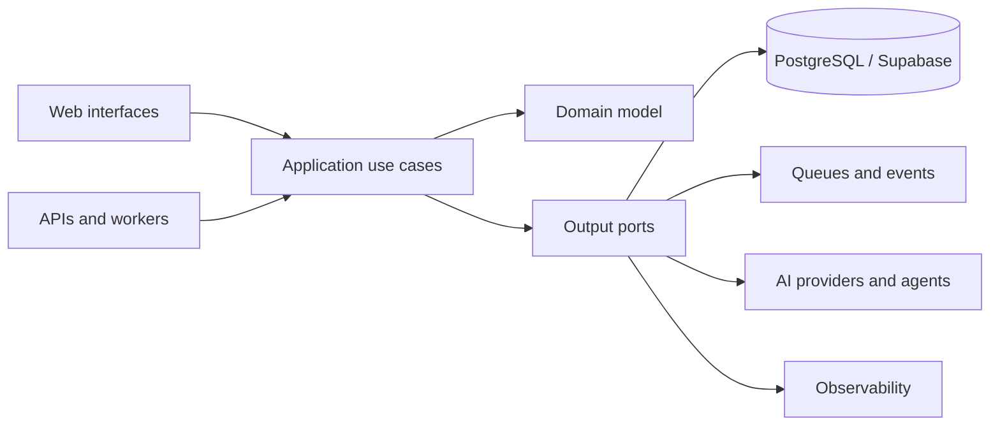

<h1 align="center">Talysson Oliveira</h1>

<p align="center">
  <strong>Full-Stack Product Engineer building AI-native SaaS platforms</strong>
</p>

<p align="center">
  London, UK · TypeScript · Next.js · Node.js · PostgreSQL · AI workflow orchestration
</p>

<p align="center">
  <a href="https://leangency.com">Leangency</a> ·
  <a href="https://www.linkedin.com/in/talyssonoliveira/">LinkedIn</a> ·
  <a href="mailto:talyssonsoliveira@gmail.com">Email</a>
</p>

---

## About me

I build type-safe web products and AI-assisted workflows from database to interface. My work focuses on domain modelling, maintainable architecture, automated testing and operational reliability—not just shipping isolated features.

I am the founder of **[Leangency](https://leangency.com)** and a BEng Software Engineering student. I am currently open to **Full-Stack Engineer** and **Product Engineer** opportunities in London and across the UK.

- Building SaaS platforms with **TypeScript, Next.js, Node.js, tRPC, Prisma and PostgreSQL**
- Applying **Domain-Driven Design** and **hexagonal architecture** to keep business logic independent from infrastructure
- Designing AI capabilities as explicit product workflows rather than disconnected chatbot features
- Using **unit, integration, end-to-end and architecture tests** to protect system behaviour
- Treating CI, security controls and observability as part of the product—not release-time additions

---

## Selected work

### Aurora — AI-native CRM

> The product direction for the repository currently named **IntelliFlow CRM** while the Aurora rebrand is completed.

**[Source](https://github.com/talyssonoliver/IntelliFlow-CRM)** · **[Architecture](https://github.com/talyssonoliver/IntelliFlow-CRM/blob/main/docs/architecture/overview.md)**

Aurora is an AI-native CRM designed to reduce repetitive lead and client-management work through specialised workers, event-driven automation and multi-agent workflows.

**Engineering focus**

- Domain-Driven Design with explicit CRM, intelligence and platform boundaries
- Hexagonal architecture with framework-independent domain logic
- Application use cases and ports separated from Prisma, queues, AI providers and external services
- Background workers for AI processing, notifications, events and ingestion
- Architecture tests, property tests, integration tests and Playwright end-to-end coverage
- Hybrid AI inference through hosted providers with an Ollama fallback
- Operational tooling for CI, code quality, security analysis and observability

```text
apps/
├── web                  Next.js product interface
├── api                  tRPC API and application composition
├── ai-worker            AI chains and agent workflows
├── workers              Notifications, events and ingestion
└── project-tracker      Internal delivery and governance tooling

packages/
├── domain               Entities, value objects and domain events
├── application          Use cases and ports
├── adapters             Infrastructure implementations
├── db                   Prisma and Supabase integration
├── validators           Shared Zod contracts
└── ui                   Shared interface components
```

**Core stack:** TypeScript · Next.js 16 · React 19 · tRPC · Prisma · Supabase/PostgreSQL · pgvector · Redis · LangChain · CrewAI · OpenAI · Ollama · Vitest · Playwright · OpenTelemetry · Prometheus · Grafana

---

### Client Acquisition OS

**[Source](https://github.com/talyssonoliver/client-acquisition-leangency)**

A client-acquisition platform for Leangency that automates lead discovery, qualification, website analysis and outreach preparation.

The system combines web analysis, background processing and structured qualification workflows to turn public business data into actionable sales opportunities.

**Engineering focus**

- Next.js application with strict TypeScript and Zod contracts
- Prisma-backed persistence and explicit dependency-boundary checks
- BullMQ and Redis workers for asynchronous discovery and enrichment jobs
- Website inspection and evidence collection through Playwright
- Vitest unit/integration testing and Playwright end-to-end testing
- Semgrep security scanning, Sentry error monitoring and PostHog analytics

**Core stack:** TypeScript · Next.js · React · Prisma · PostgreSQL · BullMQ · Redis · Playwright · Vitest · Sentry · PostHog

---

### Leangency Portal

**[Source](https://github.com/talyssonoliver/leangency-portal)**

A customer-experience and project-delivery portal that makes agency work visible and structured for non-technical clients—from strategy and discovery through approvals, project communication and delivery.

**Engineering focus**

- Product interfaces designed around client decisions rather than internal project-management terminology
- Multi-tenant data and content workflows using Supabase and Sanity
- Interactive journey, sitemap and project visualisations
- Payment, communication and document-generation integrations
- Automated unit and end-to-end validation

**Core stack:** TypeScript · Next.js 16 · React 19 · Supabase · Sanity · Stripe · Upstash Redis · Resend · React Flow · GSAP · Vitest

---

### SOTA — multi-agent engineering system

**[Source](https://github.com/talyssonoliver/sota)**

A Python multi-agent system that coordinates technical, frontend, backend, QA, product and documentation workflows through graph-based orchestration.

**Engineering focus**

- Seven specialised agents coordinated through LangGraph and CrewAI
- Dynamic workflow routing and dependency-aware task execution
- Contextual memory backed by vector storage
- Security controls for encryption, PII handling and input sanitisation
- Unit, integration and end-to-end test layers
- Execution monitoring, progress reporting and workflow automation

**Core stack:** Python · LangGraph · CrewAI · LangChain · ChromaDB · OpenAI · Pytest

---

## Engineering approach



My default engineering principles are:

1. **Model the domain before selecting abstractions.** Frameworks should support the business model, not define it.
2. **Keep core business logic infrastructure-independent.** Databases, queues and AI providers belong behind ports.
3. **Make invalid states difficult to represent.** Use strong types, schemas, invariants and explicit state transitions.
4. **Test behaviour at the correct boundary.** Unit tests for rules, integration tests for adapters and end-to-end tests for critical journeys.
5. **Treat architecture as executable.** Dependency rules and system boundaries should be enforced by automated checks.
6. **Build AI around measurable workflows.** AI should qualify, extract, classify, recommend or execute a defined operation—not exist only as a conversational layer.
7. **Design for operation.** Logging, tracing, security checks, recovery paths and deployment controls are part of implementation.

---

## Core technologies

| Area | Technologies |
|---|---|
| **Languages** | TypeScript, JavaScript, Python, SQL |
| **Frontend** | Next.js, React, Tailwind CSS, shadcn/ui, GSAP, React Flow |
| **Backend** | Node.js, tRPC, NestJS, Prisma, PostgreSQL, Redis, BullMQ |
| **Architecture** | Domain-Driven Design, Hexagonal Architecture, Ports and Adapters, event-driven workflows |
| **AI systems** | LangChain, LangGraph, CrewAI, OpenAI, Ollama, pgvector, ChromaDB |
| **Quality** | Vitest, Playwright, Pytest, architecture tests, property-based tests, SonarQube |
| **Platform** | Docker, GitHub Actions, Railway, Vercel, Supabase, OpenTelemetry, Prometheus, Grafana, Sentry |

---

## Current focus

- Completing Aurora's CRM, intelligence and workflow-automation capabilities
- Consolidating Leangency's client acquisition and customer-delivery platforms
- Preparing for Full-Stack and Product Engineer roles where product thinking, architecture and implementation are owned end to end

---

## Contact

- **Email:** [talyssonsoliveira@gmail.com](mailto:talyssonsoliveira@gmail.com)
- **LinkedIn:** [linkedin.com/in/talyssonoliveira](https://www.linkedin.com/in/talyssonoliveira/)
- **Business:** [leangency.com](https://leangency.com)
