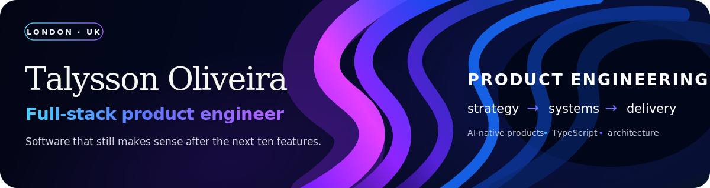

  

  
  
  
  

## Hello

I’m a Brazilian software engineer based in London and the founder of [Leangency](https://leangency.com).

I like taking a product from the awkward early stage—when the requirements are still fuzzy and the workflows live in people’s heads—and turning it into software that is clear, testable and useful. Most of my work sits between **product engineering**, **full-stack TypeScript** and **workflow automation**.

Right now I’m building **Aurora**, an AI-assisted CRM named after my daughter, while finishing my BEng in Software Engineering. I’m looking for a Full-Stack or Product Engineer role where I can own problems end to end: understanding the user, shaping the system and shipping the result.

---

## What I’m building

<table>
<tr>
<td width="50%" valign="top">

### Aurora

**A CRM that should do more than store records.**

Aurora explores how lead qualification, follow-ups, ingestion and client workflows can be handled by specialised workers without turning the core product into a tangle of AI-provider code.

The repository is still named IntelliFlow CRM while the rebrand is completed.

`TypeScript` `Next.js` `tRPC` `Prisma` `PostgreSQL` `Redis` `LangChain` `CrewAI`

[Repository →](https://github.com/talyssonoliver/IntelliFlow-CRM) · [Architecture notes →](https://github.com/talyssonoliver/IntelliFlow-CRM/blob/main/docs/architecture/overview.md)

</td>
<td width="50%" valign="top">

### Leangency Portal

**Making agency work understandable to the client.**

A customer portal for discovery, journeys, scope approval, project communication, payments and delivery. The product is designed around the decisions clients need to make—not internal project-management jargon.

`TypeScript` `Next.js 16` `Supabase` `Sanity` `Stripe` `React Flow` `Vitest`

[Repository →](https://github.com/talyssonoliver/leangency-portal) · [Leangency →](https://leangency.com)

</td>
</tr>
<tr>
<td width="50%" valign="top">

### Client Acquisition OS

**Turning public business data into a useful sales workflow.**

The system discovers leads, checks their web presence, collects evidence, runs structured audits and prepares outreach. Background queues keep long-running discovery and enrichment work away from the request path.

`TypeScript` `Next.js` `Prisma` `BullMQ` `Redis` `Playwright` `Sentry` `PostHog`

[Repository →](https://github.com/talyssonoliver/client-acquisition-leangency)

</td>
<td width="50%" valign="top">

### SOTA

**My earlier experiment in multi-agent software delivery.**

A Python system coordinating seven specialised agents across technical planning, frontend, backend, QA, product and documentation work. It includes graph-based routing, contextual memory and automated validation.

`Python` `LangGraph` `CrewAI` `LangChain` `ChromaDB` `Pytest`

[Repository →](https://github.com/talyssonoliver/sota)

</td>
</tr>
</table>

---

## How I think about software

- **Start with the workflow.** A clean domain model usually begins with understanding what people actually do, where they hesitate and what they repeat.
- **Keep business rules away from frameworks.** Databases, queues and AI providers are replaceable; the behaviour of the product is not.
- **Test the promise, not the implementation.** Unit tests protect rules, integration tests protect boundaries and end-to-end tests protect the journeys that matter.
- **Make architecture visible.** Boundaries should exist in the repository structure, dependency rules and CI—not only in diagrams.
- **AI has to earn its place.** I use it when it can extract, classify, recommend or remove a real step from someone’s work.

---

## Toolbox

  

| I use most | For |
|---|---|
| **TypeScript, Next.js, React** | Product interfaces and full-stack web applications |
| **Node.js, tRPC, NestJS** | APIs, use cases and background services |
| **Prisma, PostgreSQL, Supabase, Redis** | Persistence, search, queues and real-time data |
| **Vitest, Playwright, Pytest** | Behaviour, adapter and journey-level confidence |
| **LangChain, LangGraph, CrewAI, pgvector** | Structured AI workflows and retrieval |
| **Docker, GitHub Actions, OpenTelemetry** | Repeatable delivery and observable systems |

---

## Current chapter

- Completing the Aurora product and rebrand
- Consolidating Leangency’s acquisition and client-delivery platforms
- Finishing my BEng in Software Engineering
- Open to **Full-Stack Engineer** and **Product Engineer** roles in London or remote across the UK

  <strong>Have a role, product problem or interesting system to discuss?</strong> 
  <a href="mailto:talyssonsoliveira@gmail.com">Email me</a> ·
  <a href="https://www.linkedin.com/in/talyssonoliveira/">LinkedIn</a> ·
  <a href="https://leangency.com">Leangency</a>

